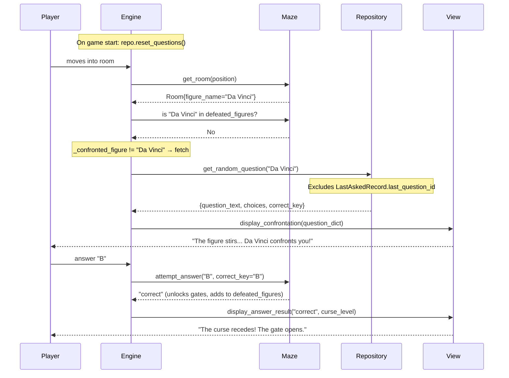
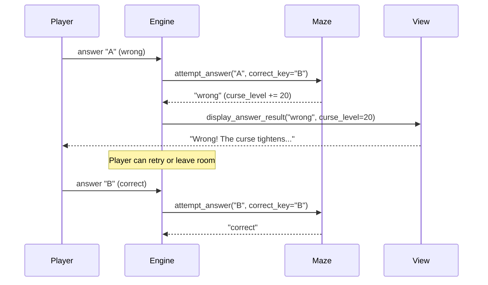

# RFC: Fleshing Out the MVP — Converged Refactoring Proposal

> How `interfaces.md`, the test suite, and all modules should change to support **SQLModel**, **Fog of War**, **View separation**, and **Waxworks theming**. Incorporates contributions from Megan's Domain RFC.

---

## 1. Summary of Changes

| Area | Skeleton (Current) | MVP (Proposed) |
|------|-------------------|----------------|
| **Persistence** | JSON files via `json` module | SQLModel + SQLite (`waxworks.db`) |
| **Trivia source** | Hardcoded in `maze.py` | Question Bank table in DB, served via `db.py` |
| **Maze size** | Fixed 3×3 grid | Expanded grid (suggested 5×5 or larger), configurable |
| **Fog of War** | Not implemented | `maze.py` tracks visited/visible rooms, exposes fog data |
| **Rendering** | Mixed into `main.py` Engine | Dedicated `view.py` module |
| **Domain language** | Generic (Room, Door) | Keep Room/Door — see §2.5 rationale |
| **BFS solvability** | Not needed (fixed layout) | Required for expanded/generated mazes |
| **Dependencies** | stdlib only | Add `sqlmodel` (requires `requirements.txt`) |

---

## 2. Module-by-Module Refactoring

### 2.1 `db.py` — Persistence Engineer

**Current:** Simple JSON read/write via `Repository` class.

**Proposed changes:**

#### Database schema (SQLModel)

```python
from sqlmodel import SQLModel, Field, Session, create_engine, select
from typing import Optional

class FigureRecord(SQLModel, table=True):
    """A wax figure in the museum. Inspired by Megan's Figure entity."""
    id: Optional[int] = Field(default=None, primary_key=True)
    name: str                  # e.g. "Leonardo da Vinci"
    zone: str                  # e.g. "Art Gallery"
    is_defeated: bool = False  # True after player answers correctly

class QuestionRecord(SQLModel, table=True):
    """A single trivia question, linked to a figure by figure_name."""
    id: Optional[int] = Field(default=None, primary_key=True)
    figure_name: str           # FK-like ref to FigureRecord.name
    zone: str                  # e.g. "Art Gallery"
    question_text: str
    choice_a: str
    choice_b: str
    choice_c: str
    correct_key: str           # "A", "B", or "C"
    has_been_asked: bool = False

class SaveRecord(SQLModel, table=True):
    """Stores the serialized game state as JSON text."""
    id: Optional[int] = Field(default=None, primary_key=True)
    slot_name: str = "default"
    state_json: str            # JSON string of the game state dict

class LastAskedRecord(SQLModel, table=True):
    """Tracks the last question asked per figure to avoid immediate repeats.
    Persisted in DB so it survives process restarts (Ctrl+C)."""
    id: Optional[int] = Field(default=None, primary_key=True)
    figure_name: str = Field(unique=True)  # one row per figure
    last_question_id: int      # FK-like ref to QuestionRecord.id
```

> `FigureRecord` separates the figure's identity from the questions (inspired by Megan's RFC). `LastAskedRecord` prevents the same question from appearing on consecutive encounters, even across game restarts.

#### Updated Repository protocol

> [!WARNING]
> **Breaking change:** The `save`/`load` signature changes from `filepath: str` to `slot_name: str`. All existing `test_repo_contract.py` tests must be rewritten for the SQLite backend. The old JSON tests become obsolete.

```python
class RepositoryProtocol(Protocol):
    """Updated contract for SQLModel-backed persistence."""

    # -- Save / Load (BREAKING: filepath → slot_name, JSON file → SQLite) --
    def save(self, data: dict, slot_name: str = "default") -> None:
        """Persist a JSON-safe dict to the database.
        Internally serializes the dict to JSON text and stores in SaveRecord."""
        ...

    def load(self, slot_name: str = "default") -> dict | None:
        """Load a previously saved dict. Returns None if slot not found.
        Raises ValueError if stored data is corrupt."""
        ...

    # -- Question Bank (NEW) --
    def get_random_question(self, figure_name: str) -> dict | None:
        """Return a random unasked question for a specific wax figure.
        Filters by figure_name so each figure only asks from their own pool.
        Dict keys: figure_name, zone, question_text, choices, correct_key.
        Side effect: marks the question as asked (has_been_asked = True).
        Anti-repeat: excludes the last question asked for this figure
        (tracked via LastAskedRecord, persisted across process restarts).
        Returns None if all questions for that figure have been asked."""
        ...

    def reset_questions(self) -> None:
        """Reset all questions to unasked (for new game)."""
        ...

    def seed_questions(self, questions: list[dict]) -> None:
        """Populate the Question Bank from a list of dicts (idempotent)."""
        ...
```

**Constraints preserved:**
- Still returns **dicts only** — no maze types cross the boundary
- Still **cannot import** `maze` or `main`
- Still **no `print()` or `input()`**

#### Seed data

Each wax figure gets a **pool of 3–5 questions** so replays feel fresh. The DB filters `WHERE figure_name = ? AND has_been_asked = FALSE AND id != <last_asked_id>` and picks one randomly. The `LastAskedRecord` table persists the last question ID per figure so that even if the player restarts (Ctrl+C), they won't get the same question back-to-back. Example pools:

| Figure | Zone | # Questions | Sample Topics |
|--------|------|-------------|---------------|
| Leonardo da Vinci | Art Gallery | 3–5 | Mona Lisa, Last Supper, Vitruvian Man, flying machines |
| Abraham Lincoln | American History | 3–5 | Penny, Gettysburg Address, log cabin, theatre |
| Cleopatra | Ancient History | 3–5 | Asp, Mark Antony, Alexandria, Ptolemy dynasty |
| Albert Einstein | Science Lab | 3–5 | E=mc², photoelectric effect, Nobel Prize, thought experiments |
| William Shakespeare | Library | 3–5 | Romeo & Juliet, Globe Theatre, sonnets, Hamlet |
| Christopher Columbus | Map Room | 3–5 | 1492, Bahamas, Santa María, Ferdinand & Isabella |

> **Why per-figure?** Each wax figure IS the questioner — Da Vinci only asks art questions, Cleopatra only asks ancient history. This keeps the theming immersive and prevents thematic crossover.

---

### 2.2 `maze.py` — Domain Architect

**Current:** 3×3 hardcoded grid, trivia hardcoded inside `_build_skeleton_maze()`.

**Proposed changes:**

#### Expanded map — 5×5 grid

The maze expands from 3×3 to **5×5** (25 rooms). 3 wax figures guard locked gates along the path from entrance to exit.

```
  WAXWORKS MUSEUM — 5×5 MAZE LAYOUT (staircase pattern)

    Col 0         Col 1         Col 2         Col 3         Col 4
  ┌───────────┬───────────┬───────────┬───────────┬───────────┐
  │ ENTRANCE  │           │           │           │           │
  │ (0,0)   ──── (0,1)  ──── (0,2)   │           │           │
  │ is_entr   │  corridor │  corridor │           │           │
  │     │     │           │           │           │           │
  │   SOUTH   │           │           │           │           │
  ├───────────┼───────────┼───────────┼───────────┼───────────┤
  │           │ DA VINCI  │           │           │           │
  │ (1,0)   ──── (1,1)  ═🔒═ (1,2)  ──── (1,3)  │           │
  │ corridor  │ 🗿Art Gal │  corridor │  corridor │           │
  │           │           │     │     │           │           │
  │           │           │   SOUTH   │           │           │
  ├───────────┼───────────┼───────────┼───────────┼───────────┤
  │           │           │ LINCOLN   │           │           │
  │           │ (2,1)   ──── (2,2)  ═🔒═ (2,3)  ──── (2,4)  │
  │           │ corridor  │ 🗿Amer H │  corridor │  corridor │
  │           │           │           │     │     │           │
  │           │           │           │   SOUTH   │           │
  ├───────────┼───────────┼───────────┼───────────┼───────────┤
  │           │           │           │ CLEOPATRA │           │
  │           │           │ (3,2)   ──── (3,3)  ═🔒═ (3,4)  │
  │           │           │ corridor  │ 🗿Anc Hist│  corridor │
  │           │           │           │           │     │     │
  │           │           │           │           │   SOUTH   │
  ├───────────┼───────────┼───────────┼───────────┼───────────┤
  │           │           │           │           │   EXIT    │
  │           │           │           │ (4,3)   ──── (4,4)   │
  │           │           │           │ corridor  │ is_exit   │
  └───────────┴───────────┴───────────┴───────────┴───────────┘

  Legend:  ──── = OPEN passage   ═🔒═ = LOCKED gate
           SOUTH ↓ = vertical OPEN passage   │ = WALL
           🗿  = Wax figure room
```

> **Key south connections (staircase):** `(0,0)↔(1,0)`, `(1,2)↔(2,1)`, `(2,3)↔(3,2)`, `(3,4)↔(4,4)`. Each drops the player to the **west** of the next figure's row.

**Winning path (verified):** `(0,0) →S→ (1,0) →E→ (1,1) defeat Da Vinci →E→ (1,2) →S→ (2,1) →E→ (2,2) defeat Lincoln →E→ (2,3) →S→ (3,2) →E→ (3,3) defeat Cleopatra →E→ (3,4) →S→ (4,4) EXIT` — 10 moves + 3 correct answers.

**Design rules:**
- Entrance is always `(0,0)`, exit is always `(rows-1, cols-1)`
- Each figure guards exactly one LOCKED gate on the critical path
- Alternative corridors exist for exploration (fog of war value)
- BFS from entrance to exit (treating LOCKED as passable) must return True

#### Trivia data flow — Room redesign

> [!IMPORTANT]
> **Chicken-and-egg problem solved.** The current `Room.trivia: Optional[TriviaQuestion]` bakes the question into the maze at construction time. This doesn't work when questions come from the DB at runtime.
>
> **Solution:** Rooms store *which figure lives there* (`figure_name` + `zone`), NOT the question itself. The Engine fetches a question from the DB on demand when the player enters.

**Updated Room dataclass:**

```python
@dataclass
class Room:
    """One cell of the maze grid."""
    position: Position
    doors: dict[Direction, DoorState]
    figure_name: str | None = None    # Which wax figure lives here (None = corridor)
    zone: str | None = None           # Thematic zone ("Art Gallery", etc.)
    is_entrance: bool = False
    is_exit: bool = False
```

> `TriviaQuestion` is no longer stored in Room. It's fetched by the Engine from the DB via `repo.get_random_question(figure_name)` and passed to the View for display. The Maze only needs to know *who* lives in the room to validate answers.

**Updated `attempt_answer` signature** — the Engine passes the correct key from the DB:

```python
def attempt_answer(self, answer_key: str, correct_key: str) -> str:
    """Submit an answer. The Engine passes the correct_key from the DB.
    Returns: 'correct', 'wrong', 'no_figure', 'already_answered', 'game_over'."""
```

> **Decision (resolved):** Engine passes `correct_key` to Maze. This is simpler than having the Engine set a `TriviaQuestion` on the Room — it avoids adding mutable state to `Room` and keeps the Maze pure.

**Curse penalty:** **+20** per wrong answer (5 wrong = curse_level 100 = game over). This gives breathing room across 6 figures.

**Retry policy:** Player **can retry** — the figure confronts them again with the same question until they answer correctly or the curse consumes them (curse_level reaches 100). The `has_been_asked` flag in the DB is only marked after the encounter ends (correct answer or player leaves the room).

#### Scalable door unlocking (critical refactor)

> [!IMPORTANT]
> The current `attempt_answer()` in `maze.py` hardcodes which doors unlock per position:
> ```python
> if self.player_position == Position(1, 0):
>     self._set_door(1, 0, Direction.EAST, 1, 1, ...)
> elif self.player_position == Position(2, 1):
>     self._set_door(2, 1, Direction.EAST, 2, 2, ...)
> ```
> This breaks the moment we add a 3rd figure. It must be replaced with a **generic approach**.

On correct answer, unlock **all LOCKED doors in the current room** automatically:

```python
def attempt_answer(self, answer_key: str, correct_key: str) -> str:
    ...
    if answer_key.upper() == correct_key:
        self.defeated_figures.append(room.figure_name)
        # Generic: unlock ALL locked doors in this room (bidirectional)
        pos = self.player_position
        for direction, state in list(room.doors.items()):
            if state == DoorState.LOCKED:
                neighbor = self._get_neighbor(pos, direction)
                if neighbor:
                    opposite = self._opposite(direction)
                    self._set_door(pos.row, pos.col, direction,
                                   neighbor.row, neighbor.col, opposite,
                                   DoorState.OPEN)
        return "correct"
```

**Two small helpers** needed:

```python
def _get_neighbor(self, pos: Position, direction: Direction) -> Position | None:
    """Return the adjacent Position in the given direction, or None if off-grid."""
    ...

def _opposite(self, direction: Direction) -> Direction:
    """Return the opposite cardinal direction."""
    ...
```

**Result:** Adding new figures = just placing them in rooms with LOCKED doors. Zero code changes to `attempt_answer()`.

#### Fog of War — new types and methods

```python
class RoomVisibility(Enum):
    """Fog of War visibility states."""
    HIDDEN = "hidden"        # Never seen
    VISIBLE = "visible"      # Adjacent to player (can see but haven't entered)
    VISITED = "visited"      # Player has been here
    CURRENT = "current"      # Player is here now

@dataclass
class FogMapCell:
    """One cell in the fog-of-war map representation."""
    position: Position
    visibility: RoomVisibility
    has_trivia: bool = False         # True if room has a wax figure
    figure_name: str | None = None   # Name of the figure (only if VISITED/CURRENT)
    is_entrance: bool = False
    is_exit: bool = False
    doors: dict[Direction, DoorState] | None = None  # Only if VISIBLE/VISITED/CURRENT
```

New method on `MazeProtocol`:

```python
def get_fog_map(self) -> list[list[FogMapCell]]:
    """Return a 2D grid of FogMapCell for the View to render.
    
    Visibility rules:
    - CURRENT: the room the player is in
    - VISITED: rooms the player has previously entered
    - VISIBLE: rooms adjacent to the player's current room (can see doors)
    - HIDDEN: everything else
    """
    ...
```

#### BFS solvability check

```python
def is_solvable(self) -> bool:
    """Run BFS from entrance to exit, treating LOCKED doors as passable
    (assumes player will eventually answer correctly).
    Returns True if a path exists."""
    ...
```

#### Updated `GameState`

```python
@dataclass
class GameState:
    player_position: Position
    curse_level: int                # 0–100 (was wax_meter)
    game_status: GameStatus
    defeated_figures: list[str]     # figure names already cleared (was answered_figures)
    visited_positions: list[Position]
    door_states: dict[tuple[int, int], dict[Direction, DoorState]]
    # Fog is computed from visited_positions, not stored
```

> Fog of War is **not** stored in GameState — it's computed dynamically from `visited_positions`. This keeps serialization simple.

**Constraints preserved:**
- Imports only `enum`, `dataclasses`, `typing`
- No `print()`, `input()`, no imports of `db` or `main`
- Maze knows *who* lives in each room, but not the question content — that comes from the DB via Engine

---

### 2.3 `main.py` — Engine Orchestrator

**Current:** Engine class with mixed rendering + game logic.

**Proposed changes:**

#### Separate concerns (4-person split)

- **Engine (Role 3)** keeps: game loop, command dispatch, translation layer, save/load wiring, trivia request flow
- **View (Role 4)** gets: ALL rendering — moved to `view.py`

#### Updated Engine flow

```python
class Engine:
    def __init__(self, maze, repo, view, save_filepath="waxworks.db"):
        self._maze = maze
        self._repo = repo
        self._view = view  # NEW: injected View object
        self._current_question = None   # Current DB-fetched question dict
        self._confronted_figure = None  # Tracks which figure we've already fetched for
        ...

    def run(self):
        self._repo.reset_questions()  # Reset question bank for a fresh game
        self._view.display_welcome()
        while self._maze.get_game_status() == GameStatus.PLAYING:
            fog_map = self._maze.get_fog_map()
            self._view.display_fog_map(fog_map)
            self._view.display_room(...)
            # Only fetch question on FIRST entry to figure room
            # (_confronted_figure prevents re-fetching on every loop iteration)
            if room.figure_name and room.figure_name not in state.defeated_figures:
                if self._confronted_figure != room.figure_name:
                    q = self._repo.get_random_question(room.figure_name)
                    self._current_question = q
                    self._confronted_figure = room.figure_name
            command = self._view.get_input()
            self._handle_command(command)
        self._view.display_endgame(...)
```

#### Trivia from DB (per-figure) — the full flow



**Retry loop** (wrong answer):



> Each figure only asks from their own question pool. Da Vinci never asks a Cleopatra question.

---

### 2.4 `view.py` — View / UI (NEW — Role 4)

**Purpose:** Dedicated rendering module. Receives pure data, produces themed CLI output.

#### View class API

```python
class View:
    """All rendering, map drawing, and thematic text output."""

    def display_welcome(self) -> None
    def display_room(self, room, position, curse_level, game_state) -> None
    def display_fog_map(self, fog_map: list[list[FogMapCell]]) -> None
    def display_move_result(self, result: str, direction: str) -> None
    def display_confrontation(self, question_dict: dict) -> None      # "The figure stirs..."
    def display_answer_result(self, result: str, curse_level: int) -> None
    def display_save_result(self, success: bool, error: str = "") -> None
    def display_load_result(self, success: bool) -> None
    def display_endgame(self, status: GameStatus, curse_level: int) -> None
    def display_error(self, message: str) -> None
    def get_input(self, prompt: str = "> ") -> str
```

#### Fog of War ASCII rendering (example)

```
    0     1     2     3     4
  ┌─────┬─────┬─────┬─────┬─────┐
0 │ ▓▓▓ │ ▓▓▓ │ ▓▓▓ │ ▓▓▓ │ ▓▓▓ │
  ├─────┼─────┼─────┼─────┼─────┤
1 │ ░░░ │ ★YOU│══╡L╞══│ ▓▓▓ │ ▓▓▓ │
  ├─────┼─────┼─────┼─────┼─────┤
2 │ ░░░ │ ░░░ │ ▓▓▓ │ ▓▓▓ │ ▓▓▓ │
  └─────┴─────┴─────┴─────┴─────┘

Legend: ★ = You | ░ = Visited | ▓ = Hidden | L = Locked | · = Visible
```

#### Thematic vision (details in `docs/view_design.md`)

The View should make the player *feel* trapped in the museum. Key elements:

- **Curse Meter** — Melting candle ASCII art that visually shrinks as curse_level rises, with progressive dread messages at 20/40/60/80/100
- **Zone flavor text** — Each wax figure zone (Art Gallery, Ancient History, Science Lab, Library, Map Room) has distinct atmospheric room descriptions
- **Figure confrontations** — Wax figures "come to life" and *confront* the player with a framed dialogue box (inspired by Megan's RFC)
- **Game Over** — A museum plaque reveals the player as "The Newest Exhibit" with a chilling permanent-collection card
- **Victory** — Dawn breaks, the curse shatters, stats summary (rooms explored, figures defeated, curse level)
- **Ambient cues** — Progressive body warnings as curse climbs; distant clock chimes; grinding stone when gates open or stay sealed

**Constraints & coupling decision:**
- `view.py` may use `print()` ✅
- `view.py` must NOT import `db`
- `view.py` **imports type definitions from `maze`** (enums: `Direction`, `DoorState`, `GameStatus`, `RoomVisibility`; dataclasses: `FogMapCell`, `Position`). This is a **read-only type dependency**, not a logic dependency — the View never calls `Maze` methods directly. This coupling is acceptable because:
  - The types are stable contracts defined in `interfaces.md`
  - The alternative (Engine converting everything to raw dicts) adds complexity with no benefit at this project scale
  - If types change in `interfaces.md`, both View and Maze update — which is the correct behavior for a contract change

#### View performance & rendering techniques

| Technique | Priority | Why |
|-----------|----------|-----|
| **Buffered rendering** | 🔴 Must | Build full frame as one string, single `print()` — eliminates flicker |
| **ANSI screen clear** | 🔴 Must | `"\033[2J\033[H"` is instant; `os.system('clear')` spawns a subprocess every frame |
| **String building** (`join` / `StringIO`) | 🔴 Must | `str +=` in a loop is O(n²); list + `join` is O(n) |
| **ANSI colors** with fallback | 🟡 Should | Makes the game feel polished; fallback for basic terminals |
| **Frame caching / dirty flag** | 🟡 Should | Cache last rendered frame, skip re-render if state hasn't changed |
| **Cursor positioning** | 🟢 Nice | `"\033[{row};{col}H"` for partial updates (e.g., just the curse meter line) |
| **`curses` library** | ⚪ Skip | Full terminal control but heavy complexity; ANSI gives 90% of the polish |

**Implementation sketch:**

```python
import io

CLEAR_SCREEN = "\033[2J\033[H"

class View:
    def __init__(self):
        self._last_frame: str = ""

    def _render_frame(self, fog_map, room, curse_level, game_state) -> str:
        """Build complete frame in memory."""
        buf = io.StringIO()
        buf.write(self._render_header())
        buf.write(self._render_fog_map(fog_map))
        buf.write(self._render_curse_meter(curse_level))
        buf.write(self._render_room_info(room, game_state))
        return buf.getvalue()

    def refresh(self, fog_map, room, curse_level, game_state):
        """Only re-render if the frame actually changed."""
        frame = self._render_frame(fog_map, room, curse_level, game_state)
        if frame != self._last_frame:
            print(CLEAR_SCREEN + frame, end="", flush=True)
            self._last_frame = frame
```

**ANSI color palette (with disable fallback):**

```python
class Colors:
    RESET  = "\033[0m"
    RED    = "\033[91m"    # Wrong answer, danger
    GREEN  = "\033[92m"    # Correct answer, exit
    YELLOW = "\033[93m"    # Locked doors, wax warnings
    DIM    = "\033[2m"     # Visited rooms
    BOLD   = "\033[1m"     # Current room, headers

    @classmethod
    def disable(cls):
        for attr in ['RESET','RED','GREEN','YELLOW','DIM','BOLD']:
            setattr(cls, attr, "")
```

## 2.5 Domain Vocabulary — Converged Decisions

The assignment asks whether domain types should be renamed (e.g., Room → Node, Door → Firewall).

**What we keep** (museum rooms and doors are already thematic):
- `Room`, `DoorState`, `Direction`, `GameStatus`, `move()`, `attempt_answer()`

**What we adopt from Megan's RFC** (genuinely more immersive):
- `wax_meter` → **`curse_level`** — "The Curse" is the narrative threat; wax is just the symptom
- `answered_figures` → **`defeated_figures`** — reframes trivia as confrontation
- **`FigureRecord`** — separate DB entity for wax figures (identity separate from questions)
- **"confront"** language in View text — "The figure confronts you" reads better than "answer trivia"

**Why not rename everything?** Renaming `Room` → `Exhibit`, `move()` → `explore()`, `GameStatus` → `Fate` would break every test, multiply merge conflicts, and add zero functional value. The immersion comes through **View content** (zone descriptions, figure dialogue, ASCII art), not Python class names.

We **also** add new themed vocabulary:
- `RoomVisibility` (fog states: HIDDEN, VISIBLE, VISITED, CURRENT)
- `FogMapCell` (structured fog data for the View)
- Zone names in room descriptions ("Art Gallery", "Ancient History Hall", etc.)

---

## 3. Updated `interfaces.md` — Proposed Changes Summary

| Section | Change |
|---------|--------|
| §2 Shared Vocabulary | Add `RoomVisibility` enum, `FogMapCell` dataclass; refactor `Room` (remove `trivia`, add `figure_name`/`zone`) |
| §3.1 MazeProtocol | Add `get_fog_map()`, `is_solvable()`; update `attempt_answer()` for DB-driven trivia |
| §3.2 RepositoryProtocol | **BREAKING:** SQLModel backend, `filepath` → `slot_name`; add `get_random_question(figure_name)`, `reset_questions()`, `seed_questions()` |
| §3.3 Engine | Add `View` dependency; add trivia-from-DB flow |
| NEW §3.4 | Add `ViewProtocol` — contract for rendering |
| §4 Boundary Crossing | Same principle (dicts/primitives), but DB format changes from JSON file to SQLite |
| §5 Maze Layout | Replace 3×3 ASCII with expanded grid spec |

---

## 4. Test Suite Updates

### New tests for `db.py` (Persistence)

| Test | What it proves |
|------|---------------|
| `test_save_creates_db_record` | Save writes to SQLite, not JSON |
| `test_load_returns_saved_data` | Load reads from SQLite correctly |
| `test_get_random_question_returns_unasked` | Question Bank returns unasked question for given figure |
| `test_get_random_question_scoped_to_figure` | Da Vinci query never returns Cleopatra question |
| `test_get_random_question_marks_asked` | `has_been_asked` flips to True |
| `test_get_random_question_returns_none_when_exhausted` | All questions for a figure asked → returns None |
| `test_reset_questions` | All questions go back to unasked |
| `test_seed_questions_idempotent` | Seeding twice doesn't duplicate |

### New tests for `maze.py` (Fog of War)

| Test | What it proves |
|------|---------------|
| `test_fog_map_initial_state` | Only entrance is CURRENT, adjacent are VISIBLE, rest HIDDEN |
| `test_fog_map_after_move` | Previous room becomes VISITED, new room is CURRENT |
| `test_fog_map_hides_trivia_in_hidden_rooms` | Figure names not leaked for HIDDEN rooms |
| `test_expanded_maze_has_more_rooms` | Grid is larger than 3×3 |
| `test_maze_is_solvable` | BFS confirms path from entrance to exit |
| `test_trivia_from_constructor` | Maze uses passed-in trivia_data, not hardcoded |

### New tests for `view.py`

| Test | What it proves |
|------|---------------|
| `test_display_fog_map_shows_visited` | Visited rooms render, hidden rooms are obscured |
| `test_display_room_shows_themed_text` | Room descriptions use Waxworks language |
| `test_view_does_not_import_db` | Separation of concerns |
| `test_display_curse_meter` | Curse meter renders with themed visualization |

### Modified existing tests

- `test_repo_contract.py` — **must be fully rewritten** for SQLite (old JSON tests are obsolete)
- `test_maze_contract.py` — update for `Room.figure_name` instead of `Room.trivia`, new layout paths
- `test_engine_integration.py` — add `View` parameter to `Engine.__init__`, add trivia-from-DB flow tests
- `conftest.py` helpers (`_navigate_to_trivia_room`) need updating for new layout

### What goes in the Design PR (Part 1)

The Design PR merges **before** any feature branch. It should contain:

1. **Updated `interfaces.md`** — all new protocols, types, and contracts
2. **Test stubs** — new test functions with `assert False, "Not yet implemented"` bodies that define the contracts each feature branch must satisfy
3. **`requirements.txt`** — adding `sqlmodel` as a project dependency

> The tests in the Design PR are **intentionally failing**. Each feature branch makes its subset of tests pass. When all branches merge, all tests pass.

---

## 5. Dependency Rules (Updated)

| Module | May Import | May NOT Import | `print()`/`input()` |
|--------|-----------|----------------|---------------------|
| `maze.py` | `enum`, `dataclasses`, `typing` | `db`, `main`, `view` | **No** |
| `db.py` | `sqlmodel`, `typing`, stdlib | `maze`, `main`, `view` | **No** |
| `view.py` | `maze` (types only), stdlib | `db` | `print()` **Yes**, `input()` **Yes** |
| `main.py` | `maze`, `db`, `view`, stdlib | — | **Yes** (via `view`) |

---

## 6. Branch & Merge Strategy

```
main
 ├── design/architecture-update    ← Part 1: updated interfaces.md + tests (team)
 ├── feature/database-orm          ← Role 1: SQLModel refactor
 ├── feature/fog-of-war            ← Role 2: expanded maze + fog
 ├── feature/ui                    ← Role 4: view.py
 └── feature/engine-upgrade        ← Role 3: engine refactor (merges last)
```

**Merge order:** `feature/fog-of-war` → `feature/database-orm` → `feature/ui` → `feature/engine-upgrade`

(Engine goes last because it depends on all three. Fog-of-war first because it adds types that view.py needs.)

---

## 7. New Dependency: `requirements.txt`

```
sqlmodel>=0.0.14
```

All team members must run `pip install -r requirements.txt` before working on feature branches.

---

## 8. Error Handling Rules

Edge cases that each module must handle gracefully:

| Scenario | Who handles it | Behavior |
|----------|---------------|----------|
| **All questions for a figure exhausted** | `db.py` returns `None` → Engine | Engine auto-opens the gate ("The figure sighs and steps aside. The curse releases its grip on this gate."). View shows special message. |
| **DB file missing at startup** | `db.py` → Engine | Engine creates a fresh DB and seeds questions. Game starts normally. |
| **DB file corrupt** | `db.py` raises `ValueError` → Engine | View displays error message. Engine offers to start fresh or quit. |
| **Save fails** (disk full, permissions) | `db.py` raises `IOError` → Engine | View shows "Save failed" error. Game continues without saving. |
| **Load finds no save slot** | `db.py` returns `None` → Engine | View shows "No save found." Game continues. |
| **Player at exit with game already won** | `maze.py` | `move()` returns `"invalid"` if `game_status != PLAYING`. |
| **Curse reaches 100** | `maze.py` sets `GameStatus.LOST` → Engine | View shows the "Newest Exhibit" museum plaque. |
| **Invalid command entered** | Engine → View | View shows "Unknown command. Type 'help' for options." |
| **ANSI not supported by terminal** | `view.py` | `Colors.disable()` called at startup if `os.environ.get('NO_COLOR')` is set. |

---

## 9. Resolved Design Decisions

These were open questions. We now propose concrete answers for the Architecture Sync:

| Decision | Answer | Rationale |
|----------|--------|-----------|
| **Grid size** | **5×5** (25 rooms) | Large enough for 6 figures + exploration corridors; small enough to test and render in CLI |
| **Trivia per figure** | **3 questions each** (18 total) | Enough variety for replays; manageable to write |
| **Curse penalty** | **+20 per wrong answer** | 5 wrong = curse_level 100 = game over; breathing room across 6 figures |
| **Retry policy** | **Can retry** (same question) | Figure keeps confronting until player answers correctly or curse consumes them |
| **`attempt_answer` design** | **Engine passes `correct_key`** | Simpler; avoids mutable state on Room; keeps Maze pure |
| **ANSI colors** | **Yes, with `Colors.disable()` fallback** | Polished look; respects `NO_COLOR` env var for compatibility |
| **Vocab renames** (from Megan) | **Accept `curse_level`, `defeated_figures`, `FigureRecord`; reject wholesale renames** | Theme through content, not class names. `curse_level` is genuinely more immersive. |

> These are *recommendations*. The team may override any decision at the Architecture Sync.

---

*Authors: Mario (primary) · Megan (thematic contributions) · Date: 2026-03-04*
